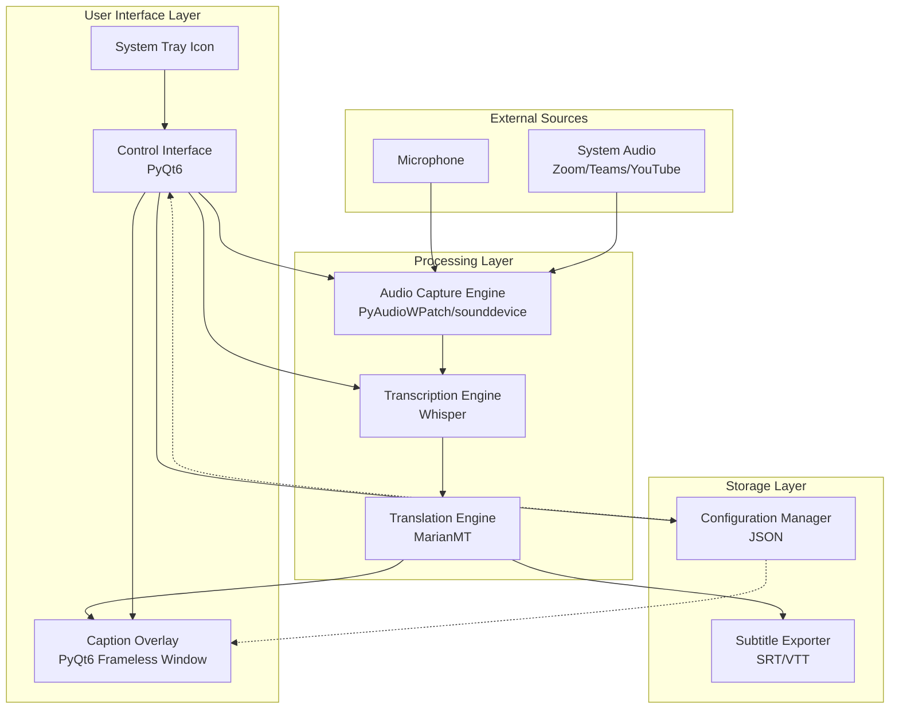

# Design Document: System-Wide Live Captions

## Overview

This design transforms OpenLiveCaption from a webcam-based subtitle display into a system-wide overlay application. The system will capture audio from system output or microphone, transcribe speech using Whisper, and display captions as an always-on-top overlay that works across all applications.

The architecture follows a modular design with four primary components:
1. **Audio Capture Engine** - Handles system audio and microphone input
2. **Transcription Engine** - Processes audio using Whisper models
3. **Overlay Manager** - Manages the system-wide caption display
4. **Control Interface** - Provides user controls and configuration

The application will be packaged as a standalone executable for Windows, macOS, and Linux using PyInstaller, eliminating the need for users to install Python or dependencies.

## Architecture

### High-Level Architecture



### Technology Stack

- **GUI Framework**: PyQt6 (cross-platform, robust overlay support)
- **Audio Capture**: 
  - Windows: PyAudioWPatch (WASAPI loopback support)
  - macOS/Linux: sounddevice (fallback to microphone)
- **Transcription**: OpenAI Whisper (existing)
- **Translation**: MarianMT (existing)
- **Packaging**: PyInstaller (cross-platform executable generation)
- **Configuration**: JSON file storage

### Design Rationale

**PyQt6 over Tkinter**: PyQt6 provides superior support for transparent, click-through, always-on-top windows across platforms. Tkinter has limitations with transparency and window flags on macOS and Linux.

**PyAudioWPatch for Windows**: Standard PyAudio lacks WASAPI loopback support. PyAudioWPatch is a fork that enables system audio capture on Windows without requiring virtual audio cables.

**PyInstaller over cx_Freeze**: PyInstaller has better cross-platform support, handles complex dependencies (like Whisper and PyTorch) more reliably, and produces smaller executables.

## Components and Interfaces

### 1. Audio Capture Engine

**Responsibility**: Capture audio from system output or microphone and provide audio chunks to the transcription engine.

**Class**: `AudioCaptureEngine`

**Key Methods**:
```python
class AudioCaptureEngine:
    def __init__(self, config: AudioConfig):
        """Initialize audio capture with configuration"""
        
    def list_devices(self) -> List[AudioDevice]:
        """List available audio input and loopback devices"""
        
    def start_capture(self, device_id: int, callback: Callable[[np.ndarray], None]):
        """Start capturing audio and call callback with audio chunks"""
        
    def stop_capture(self):
        """Stop audio capture"""
        
    def set_device(self, device_id: int):
        """Switch to a different audio device"""
        
    def get_audio_level(self) -> float:
        """Get current audio input level (0.0 to 1.0)"""
```

**Platform-Specific Implementation**:

- **Windows**: Use PyAudioWPatch with WASAPI loopback flag
  ```python
  import pyaudiowpatch as pyaudio
  
  # Find loopback device
  wasapi_info = p.get_host_api_info_by_type(pyaudio.paWASAPI)
  default_speakers = p.get_device_info_by_index(
      wasapi_info["defaultOutputDevice"]
  )
  
  # Check if loopback is supported
  if default_speakers["isLoopbackDevice"]:
      # Open loopback stream
      stream = p.open(
          format=pyaudio.paInt16,
          channels=default_speakers["maxInputChannels"],
          rate=int(default_speakers["defaultSampleRate"]),
          input=True,
          input_device_index=default_speakers["index"]
      )
  ```

- **macOS**: Use sounddevice with BlackHole or similar virtual audio device (user must install)
  ```python
  import sounddevice as sd
  
  # List devices and find loopback
  devices = sd.query_devices()
  # User selects BlackHole or similar
  ```

- **Linux**: Use sounddevice with PulseAudio monitor sources
  ```python
  import sounddevice as sd
  
  # Find monitor sources (*.monitor)
  devices = sd.query_devices()
  monitor_devices = [d for d in devices if '.monitor' in d['name']]
  ```

**Audio Processing**:
- Sample rate: 16000 Hz (Whisper requirement)
- Chunk duration: 1.0 seconds (configurable)
- Format: float32 numpy array
- Voice Activity Detection (VAD): Optional silence detection to pause processing

### 2. Transcription Engine

**Responsibility**: Process audio chunks using Whisper and optionally translate results.

**Class**: `TranscriptionEngine`

**Key Methods**:
```python
class TranscriptionEngine:
    def __init__(self, model_name: str = "tiny", device: str = "cpu"):
        """Initialize Whisper model"""
        
    def transcribe(self, audio: np.ndarray, language: Optional[str] = None) -> TranscriptionResult:
        """Transcribe audio chunk and return text with metadata"""
        
    def change_model(self, model_name: str):
        """Load a different Whisper model size"""
        
    def set_language(self, language: Optional[str]):
        """Set fixed language or None for auto-detect"""
```

**TranscriptionResult**:
```python
@dataclass
class TranscriptionResult:
    text: str
    language: str
    confidence: float
    start_time: float
    end_time: float
```

**Optimization Strategy**:
- Use smallest model (tiny) by default for low latency
- Allow user to select larger models for accuracy
- Process audio in 1-second chunks with 0.5-second overlap to avoid cutting words
- Cache model in memory (don't reload between chunks)
- Use CPU by default; optionally use GPU if available

**Chunk Processing**:
```python
# Overlapping window approach
buffer = []
overlap = 0.5  # seconds

while capturing:
    chunk = get_audio_chunk(duration=1.0)
    buffer.append(chunk)
    
    if len(buffer) >= 2:
        # Combine last two chunks with overlap
        combined = np.concatenate(buffer[-2:])
        result = transcribe(combined)
        
        # Keep only last chunk for next iteration
        buffer = buffer[-1:]
```

### 3. Translation Engine

**Responsibility**: Translate transcribed text to target language (optional feature).

**Class**: `TranslationEngine`

**Key Methods**:
```python
class TranslationEngine:
    def __init__(self):
        """Initialize with lazy model loading"""
        
    def translate(self, text: str, target_lang: str) -> str:
        """Translate text to target language"""
        
    def list_supported_languages(self) -> List[str]:
        """Return list of supported target languages"""
```

**Implementation**: Reuse existing MarianMT implementation from Main.py with lazy loading.

### 4. Overlay Manager

**Responsibility**: Display captions as an always-on-top, click-through overlay window.

**Class**: `CaptionOverlay` (inherits from `QWidget`)

**Key Methods**:
```python
class CaptionOverlay(QWidget):
    def __init__(self, config: OverlayConfig):
        """Initialize overlay window with styling"""
        
    def update_caption(self, text: str):
        """Update displayed caption text"""
        
    def set_position(self, position: Position):
        """Set overlay position (top/bottom/custom)"""
        
    def set_style(self, style: CaptionStyle):
        """Update font, colors, opacity"""
        
    def show_overlay(self):
        """Make overlay visible"""
        
    def hide_overlay(self):
        """Hide overlay"""
```

**Window Configuration**:
```python
# PyQt6 window flags for overlay behavior
self.setWindowFlags(
    Qt.WindowType.FramelessWindowHint |      # No title bar
    Qt.WindowType.WindowStaysOnTopHint |     # Always on top
    Qt.WindowType.Tool |                      # Don't show in taskbar
    Qt.WindowType.WindowTransparentForInput  # Click-through
)

# Transparent background
self.setAttribute(Qt.WidgetAttribute.WA_TranslucentBackground)

# Set opacity
self.setWindowOpacity(0.9)
```

**Caption Display**:
- Maximum 3 lines of text
- Text wrapping at word boundaries
- Scroll mode: Replace old text or scroll upward
- Configurable font family, size, color
- Configurable background color and opacity
- Text shadow/outline for readability

**Position Management**:
```python
class Position(Enum):
    TOP = "top"
    BOTTOM = "bottom"
    CUSTOM = "custom"

def set_position(self, position: Position, custom_x: int = 0, custom_y: int = 0):
    screen = QApplication.primaryScreen().geometry()
    
    if position == Position.TOP:
        self.move(0, 0)
        self.resize(screen.width(), 150)
    elif position == Position.BOTTOM:
        self.move(0, screen.height() - 150)
        self.resize(screen.width(), 150)
    elif position == Position.CUSTOM:
        self.move(custom_x, custom_y)
```

### 5. Control Interface

**Responsibility**: Provide user controls for starting/stopping captions and configuring settings.

**Class**: `ControlWindow` (inherits from `QMainWindow`)

**Key Methods**:
```python
class ControlWindow(QMainWindow):
    def __init__(self):
        """Initialize control window and system tray"""
        
    def start_captions(self):
        """Start audio capture and transcription"""
        
    def stop_captions(self):
        """Stop audio capture and transcription"""
        
    def show_settings(self):
        """Open settings dialog"""
        
    def minimize_to_tray(self):
        """Hide window and show tray icon"""
```

**UI Layout**:
```
┌─────────────────────────────────────┐
│  OpenLiveCaption                    │
├─────────────────────────────────────┤
│  Status: ● Running                  │
│                                     │
│  [Start Captions] [Stop Captions]  │
│                                     │
│  Audio Source: [System Audio ▼]    │
│  Model Size:   [tiny ▼]            │
│  Language:     [Auto-detect ▼]     │
│                                     │
│  [⚙ Settings] [📊 Show Overlay]    │
└─────────────────────────────────────┘
```

**System Tray**:
- Icon shows status (active/inactive)
- Right-click menu:
  - Start/Stop Captions
  - Show/Hide Overlay
  - Settings
  - Exit

**Settings Dialog**:
- Audio tab: Device selection, VAD threshold
- Transcription tab: Model size, language, translation
- Overlay tab: Position, font, colors, opacity
- Export tab: SRT/VTT file location
- Keyboard shortcuts

### 6. Configuration Manager

**Responsibility**: Persist user preferences and settings.

**Class**: `ConfigManager`

**Key Methods**:
```python
class ConfigManager:
    def __init__(self, config_path: str):
        """Initialize with config file path"""
        
    def load(self) -> Config:
        """Load configuration from file"""
        
    def save(self, config: Config):
        """Save configuration to file"""
        
    def get_default(self) -> Config:
        """Return default configuration"""
```

**Configuration Structure**:
```python
@dataclass
class Config:
    audio: AudioConfig
    transcription: TranscriptionConfig
    overlay: OverlayConfig
    export: ExportConfig
    shortcuts: ShortcutConfig

@dataclass
class AudioConfig:
    device_id: int
    sample_rate: int = 16000
    chunk_duration: float = 1.0
    vad_threshold: float = 0.01
    
@dataclass
class TranscriptionConfig:
    model_name: str = "tiny"
    device: str = "cpu"
    language: Optional[str] = None
    enable_translation: bool = False
    target_language: Optional[str] = None
    
@dataclass
class OverlayConfig:
    position: str = "bottom"
    custom_x: int = 0
    custom_y: int = 0
    width: int = 0  # 0 = full screen width
    height: int = 150
    font_family: str = "Arial"
    font_size: int = 24
    text_color: str = "#FFFFFF"
    background_color: str = "#000000"
    background_opacity: float = 0.7
    max_lines: int = 3
    scroll_mode: str = "replace"  # or "scroll"
    clear_timeout: float = 5.0
    
@dataclass
class ExportConfig:
    enabled: bool = True
    format: str = "srt"  # or "vtt"
    output_path: str = "subtitles.srt"
    
@dataclass
class ShortcutConfig:
    start_stop: str = "Ctrl+Shift+S"
    show_hide: str = "Ctrl+Shift+H"
```

**Storage Location**:
- Windows: `%APPDATA%/OpenLiveCaption/config.json`
- macOS: `~/Library/Application Support/OpenLiveCaption/config.json`
- Linux: `~/.config/OpenLiveCaption/config.json`

### 7. Subtitle Exporter

**Responsibility**: Export captions to SRT or VTT format.

**Class**: `SubtitleExporter`

**Key Methods**:
```python
class SubtitleExporter:
    def __init__(self, output_path: str, format: str = "srt"):
        """Initialize exporter with output file"""
        
    def add_subtitle(self, text: str, start_time: float, end_time: float):
        """Add a subtitle entry"""
        
    def finalize(self):
        """Close and finalize the subtitle file"""
```

**SRT Format**:
```
1
00:00:00,000 --> 00:00:02,000
First caption text

2
00:00:02,000 --> 00:00:05,000
Second caption text
```

**VTT Format**:
```
WEBVTT

00:00:00.000 --> 00:00:02.000
First caption text

00:00:02.000 --> 00:00:05.000
Second caption text
```

## Data Models

### Audio Data Flow

```python
# Raw audio from device
AudioChunk = np.ndarray  # shape: (samples,), dtype: float32

# Processed transcription
@dataclass
class TranscriptionResult:
    text: str
    language: str
    confidence: float
    start_time: float
    end_time: float
    
# Optional translation
@dataclass
class CaptionData:
    original_text: str
    translated_text: Optional[str]
    language: str
    timestamp: float
```

### Configuration Data

See Configuration Manager section above for complete data models.

### Application State

```python
@dataclass
class ApplicationState:
    is_capturing: bool = False
    is_transcribing: bool = False
    current_device: Optional[AudioDevice] = None
    current_model: str = "tiny"
    overlay_visible: bool = True
    last_caption: Optional[CaptionData] = None
```

## Correctness Properties

*A property is a characteristic or behavior that should hold true across all valid executions of a system—essentially, a formal statement about what the system should do. Properties serve as the bridge between human-readable specifications and machine-verifiable correctness guarantees.*


### Property Reflection

After analyzing all acceptance criteria, I've identified the following redundancies:

1. **Requirements 1.1 and 1.2** both test that the overlay stays on top - these can be combined into one property
2. **Requirements 2.1 and 4.4** both test system audio capture - 4.4 is redundant
3. **Requirements 2.5 and 8.6** both test low-power state when no audio - 8.6 is redundant
4. **Requirements 1.1 and 12.7** both test platform-native always-on-top behavior - 12.7 is redundant
5. **Requirements 1.5 and 7.6** both test opacity configuration - these can be combined

After removing redundancies, the testable properties are:

**Overlay Properties (7)**:
- 1.1: Always-on-top window behavior
- 1.3: Click-through transparency
- 1.4: Position/size persistence (round-trip)
- 1.5/7.6: Opacity configuration (combined)
- 7.1: Font configuration
- 7.2: Text wrapping
- 7.3: Maximum 3 lines
- 7.4: Scroll vs replace modes
- 7.5: Color configuration
- 7.8: Auto-clear timeout

**Audio Capture Properties (5)**:
- 2.3: Device switching without restart
- 2.4: Simultaneous multi-source capture
- 2.5: Pause on silence
- 2.6: Device disconnection handling
- 9.1: Capture failure recovery

**Transcription Properties (7)**:
- 3.3: Support all model sizes
- 3.4: Model switching without restart
- 3.6: Manual language override
- 3.7: Overlapping chunk processing
- 9.2: Continue after transcription errors
- 10.1: Translation when enabled
- 10.5: Translation model caching

**Configuration Properties (3)**:
- 6.8: Keyboard shortcuts
- 6.9: Minimize to tray on close
- 6.10: Preferences persistence (round-trip)

**Export Properties (4)**:
- 11.1: SRT export with timestamps (round-trip)
- 11.3: File finalization on session end
- 11.4: VTT format support
- 11.5: Dual-language export

**Error Handling Properties (2)**:
- 9.4: Overlay recreation on unexpected close
- 9.5: Device change detection

**Platform-Specific Properties (3)**:
- 12.4: Windows WASAPI usage
- 12.5: macOS Core Audio usage
- 12.6: Linux PulseAudio/PipeWire usage

Total: 31 testable properties

### Correctness Properties

Property 1: Overlay always-on-top behavior
*For any* Caption_Overlay instance, the window flags should include WindowStaysOnTopHint, ensuring the overlay appears above all other applications
**Validates: Requirements 1.1, 1.2**

Property 2: Overlay click-through transparency
*For any* Caption_Overlay instance, the window should have the WindowTransparentForInput attribute set, allowing mouse clicks to pass through to underlying applications
**Validates: Requirements 1.3**

Property 3: Overlay position persistence
*For any* overlay position and size configuration, saving the configuration then loading it should restore the exact same position and size values
**Validates: Requirements 1.4**

Property 4: Overlay opacity configuration
*For any* opacity value between 0.0 and 1.0, setting the overlay opacity should result in the window having that exact opacity value
**Validates: Requirements 1.5, 7.6**

Property 5: Font configuration
*For any* valid font family and size, setting the caption font should result in text being rendered with that exact font family and size
**Validates: Requirements 7.1**

Property 6: Text wrapping at word boundaries
*For any* caption text that exceeds the overlay width, the text should be wrapped at word boundaries without breaking words mid-character
**Validates: Requirements 7.2**

Property 7: Maximum three lines display
*For any* caption text, the overlay should never display more than 3 lines of text simultaneously
**Validates: Requirements 7.3**

Property 8: Scroll and replace modes
*For any* sequence of caption updates, in scroll mode the text should move upward with new text at bottom, and in replace mode the text should be completely replaced
**Validates: Requirements 7.4**

Property 9: Color configuration
*For any* valid RGB color values for text and background, setting these colors should result in the overlay displaying text and background in those exact colors
**Validates: Requirements 7.5**

Property 10: Auto-clear timeout
*For any* configured timeout value, when no new captions arrive for that duration, the overlay should clear all displayed text
**Validates: Requirements 7.8**

Property 11: Audio device switching
*For any* audio device, calling set_device() should switch to that device without requiring application restart, and subsequent audio capture should come from the new device
**Validates: Requirements 2.3**

Property 12: Simultaneous multi-source capture
*For any* two audio sources (e.g., system audio and microphone), the Audio_Capture_Engine should be able to capture from both simultaneously and mix the audio streams
**Validates: Requirements 2.4**

Property 13: Pause on silence
*For any* configured silence threshold and duration, when audio levels remain below the threshold for that duration, the Audio_Capture_Engine should enter a paused state
**Validates: Requirements 2.5**

Property 14: Device disconnection recovery
*For any* audio device disconnection event, the Audio_Capture_Engine should detect the disconnection, not crash, and attempt to reconnect when the device becomes available
**Validates: Requirements 2.6**

Property 15: Audio capture failure recovery
*For any* audio capture failure, the Audio_Capture_Engine should display an error notification and attempt to reconnect without terminating the application
**Validates: Requirements 9.1**

Property 16: All Whisper model sizes supported
*For any* Whisper model size (tiny, base, small, medium, large), the Transcription_Engine should successfully load and use that model for transcription
**Validates: Requirements 3.3**

Property 17: Model switching without restart
*For any* two different Whisper model sizes, calling change_model() should switch from the first to the second model without requiring application restart
**Validates: Requirements 3.4**

Property 18: Manual language override
*For any* supported language code, setting a fixed language should override auto-detection and force transcription in that language
**Validates: Requirements 3.6**

Property 19: Overlapping chunk processing
*For any* continuous audio stream, the Transcription_Engine should process audio in overlapping chunks to avoid cutting words at chunk boundaries
**Validates: Requirements 3.7**

Property 20: Continue after transcription errors
*For any* transcription error, the Transcription_Engine should log the error and continue processing subsequent audio chunks without stopping
**Validates: Requirements 9.2**

Property 21: Translation when enabled
*For any* transcribed text, when translation is enabled, the Transcription_Engine should produce both original and translated text
**Validates: Requirements 10.1**

Property 22: Translation model caching
*For any* translation model, loading the model a second time should not trigger a download or reload, but should use the cached model
**Validates: Requirements 10.5**

Property 23: Keyboard shortcuts trigger actions
*For any* configured keyboard shortcut, pressing that shortcut should trigger the associated action (start/stop, show/hide)
**Validates: Requirements 6.8**

Property 24: Minimize to tray on close
*For any* close event on the main window, the Control_Interface should minimize to the system tray rather than exiting the application
**Validates: Requirements 6.9**

Property 25: Preferences persistence
*For any* user configuration, saving the preferences then restarting the application should restore all preferences to their exact saved values
**Validates: Requirements 6.10**

Property 26: SRT export round-trip
*For any* sequence of captions with timestamps, exporting to SRT format then parsing the SRT file should produce captions with equivalent text and timestamps
**Validates: Requirements 11.1**

Property 27: File finalization on session end
*For any* active subtitle export, calling stop_captions() should finalize and properly close the subtitle file
**Validates: Requirements 11.3**

Property 28: VTT format support
*For any* sequence of captions, exporting to VTT format should produce a valid VTT file with correct timestamps and text
**Validates: Requirements 11.4**

Property 29: Dual-language export
*For any* caption sequence with translation enabled, the exported subtitle file should contain both original and translated text
**Validates: Requirements 11.5**

Property 30: Overlay recreation on unexpected close
*For any* unexpected closure of the Caption_Overlay window, the Overlay_Manager should detect the closure and automatically recreate the overlay
**Validates: Requirements 9.4**

Property 31: Device change detection
*For any* system audio device change event, the Audio_Capture_Engine should detect the change and prompt the user to reconfigure
**Validates: Requirements 9.5**

## Error Handling

### Audio Capture Errors

**Device Not Found**:
- Display user-friendly error: "Audio device not found. Please check your audio settings."
- Provide button to refresh device list
- Log technical details for debugging

**Permission Denied**:
- Display error: "Microphone access denied. Please grant permission in system settings."
- Provide link to system settings (platform-specific)
- Gracefully disable audio capture until permission granted

**Device Disconnection**:
- Display notification: "Audio device disconnected. Attempting to reconnect..."
- Attempt reconnection every 5 seconds
- Allow user to manually select different device

**Capture Stream Failure**:
- Log error with technical details
- Attempt to restart capture stream
- If repeated failures (3+ times), prompt user to select different device

### Transcription Errors

**Model Loading Failure**:
- Display error: "Failed to load Whisper model. Please check your installation."
- Provide troubleshooting steps:
  - Check available disk space
  - Verify internet connection (for first-time model download)
  - Try smaller model size
- Allow user to retry or select different model

**Transcription Timeout**:
- Log warning: "Transcription took longer than expected"
- Continue processing next chunk
- If repeated timeouts, suggest using smaller model

**Out of Memory**:
- Display error: "Insufficient memory for transcription. Try a smaller model."
- Automatically switch to smaller model if possible
- Provide option to close other applications

**Invalid Audio Data**:
- Log warning: "Invalid audio data received, skipping chunk"
- Continue processing next chunk
- Don't display error to user (transient issue)

### Overlay Errors

**Window Creation Failure**:
- Display error: "Failed to create overlay window. Please restart the application."
- Log technical details
- Attempt to recreate window
- If repeated failures, suggest checking display drivers

**Rendering Failure**:
- Log error with details
- Clear overlay and attempt to re-render
- If repeated failures, disable overlay and notify user

### Configuration Errors

**Config File Corrupted**:
- Log warning: "Configuration file corrupted, using defaults"
- Load default configuration
- Backup corrupted file for debugging
- Save new valid configuration

**Invalid Config Values**:
- Log warning: "Invalid configuration value for {key}, using default"
- Use default value for invalid setting
- Continue with other valid settings
- Save corrected configuration

### Translation Errors

**Model Download Failure**:
- Display error: "Failed to download translation model. Check internet connection."
- Disable translation temporarily
- Allow user to retry download
- Continue with original text only

**Translation Failure**:
- Log warning: "Translation failed for text: {text}"
- Display original text only
- Continue processing next caption
- Don't interrupt transcription flow

### Export Errors

**File Write Failure**:
- Display error: "Failed to save subtitle file. Check disk space and permissions."
- Attempt to save to alternative location (temp directory)
- Keep captions in memory for manual save
- Provide option to copy captions to clipboard

**Invalid File Path**:
- Display error: "Invalid file path. Please choose a different location."
- Prompt user to select new file path
- Use default location as fallback

## Testing Strategy

### Dual Testing Approach

This feature requires both unit tests and property-based tests for comprehensive coverage:

**Unit Tests**: Focus on specific examples, edge cases, and integration points
- UI component existence and layout
- Platform-specific API usage (Windows WASAPI, macOS Core Audio, Linux PulseAudio)
- Error message content and formatting
- Specific example inputs (e.g., empty audio, specific text strings)
- Integration between components

**Property-Based Tests**: Verify universal properties across all inputs
- Configuration round-trips (save/load)
- Text wrapping and display logic
- Audio processing pipelines
- Overlay behavior with various window states
- Caption export format correctness

### Property-Based Testing Configuration

**Library Selection**:
- Python: Use `hypothesis` library for property-based testing
- Install: `pip install hypothesis`

**Test Configuration**:
- Minimum 100 iterations per property test (due to randomization)
- Each test must reference its design document property
- Tag format: `# Feature: system-wide-live-captions, Property {number}: {property_text}`

**Example Property Test Structure**:
```python
from hypothesis import given, strategies as st
import pytest

# Feature: system-wide-live-captions, Property 3: Overlay position persistence
@given(
    x=st.integers(min_value=0, max_value=3840),
    y=st.integers(min_value=0, max_value=2160),
    width=st.integers(min_value=100, max_value=1920),
    height=st.integers(min_value=50, max_value=500)
)
def test_overlay_position_persistence(x, y, width, height):
    """For any overlay position and size, saving then loading should restore exact values"""
    config = OverlayConfig(custom_x=x, custom_y=y, width=width, height=height)
    
    # Save configuration
    config_manager = ConfigManager("test_config.json")
    config_manager.save(config)
    
    # Load configuration
    loaded_config = config_manager.load()
    
    # Verify round-trip
    assert loaded_config.custom_x == x
    assert loaded_config.custom_y == y
    assert loaded_config.width == width
    assert loaded_config.height == height
```

### Test Organization

**Unit Test Structure**:
```
tests/
├── unit/
│   ├── test_audio_capture.py
│   ├── test_transcription.py
│   ├── test_overlay.py
│   ├── test_control_interface.py
│   ├── test_config_manager.py
│   └── test_subtitle_exporter.py
├── property/
│   ├── test_overlay_properties.py
│   ├── test_audio_properties.py
│   ├── test_transcription_properties.py
│   ├── test_config_properties.py
│   └── test_export_properties.py
├── integration/
│   ├── test_end_to_end.py
│   └── test_platform_specific.py
└── conftest.py
```

### Key Test Scenarios

**Overlay Tests**:
- Window flags and attributes (always-on-top, click-through, transparency)
- Position and size persistence across restarts
- Font and color configuration
- Text wrapping with various string lengths
- Maximum 3 lines enforcement
- Scroll vs replace modes
- Auto-clear timeout

**Audio Capture Tests**:
- Device enumeration and selection
- Device switching without restart
- Simultaneous multi-source capture
- Silence detection and pause behavior
- Device disconnection and reconnection
- Error handling and recovery

**Transcription Tests**:
- All Whisper model sizes load successfully
- Model switching without restart
- Language detection and manual override
- Overlapping chunk processing
- Error recovery and continuation
- Translation integration

**Configuration Tests**:
- Round-trip persistence of all settings
- Default configuration generation
- Invalid value handling
- Config file corruption recovery

**Export Tests**:
- SRT format correctness
- VTT format correctness
- Timestamp accuracy
- Dual-language export
- File finalization

**Integration Tests**:
- End-to-end caption flow (audio → transcription → display → export)
- Platform-specific audio API usage
- Keyboard shortcuts
- System tray functionality
- Multi-component error propagation

### Mocking Strategy

**Audio Hardware**: Mock audio devices and streams for unit tests
```python
@pytest.fixture
def mock_audio_device():
    return Mock(spec=AudioDevice)
```

**Whisper Model**: Mock for fast unit tests, use real model for integration tests
```python
@pytest.fixture
def mock_whisper_model():
    model = Mock()
    model.transcribe.return_value = {"text": "test transcription", "language": "en"}
    return model
```

**File System**: Use temporary directories for config and export tests
```python
@pytest.fixture
def temp_config_dir(tmp_path):
    return tmp_path / "config"
```

### Performance Testing

While not part of automated tests, manual performance testing should verify:
- Transcription latency < 2 seconds (Requirement 3.2)
- Memory usage within limits (Requirements 8.1, 8.2)
- Application startup time < 5 seconds (Requirement 8.7)
- CPU usage reasonable during idle and active transcription

### Platform-Specific Testing

Each platform requires specific testing:

**Windows**:
- WASAPI loopback audio capture
- System tray icon behavior
- Installer/uninstaller functionality

**macOS**:
- Core Audio capture (with BlackHole)
- Menu bar icon behavior
- DMG installer functionality
- Fullscreen app overlay behavior

**Linux**:
- PulseAudio/PipeWire capture
- System tray icon (various desktop environments)
- AppImage/Flatpak functionality

## Packaging and Distribution

### PyInstaller Configuration

**Build Script** (`build.py`):
```python
import PyInstaller.__main__
import sys
import os

# Determine platform
platform = sys.platform

# Common options
common_args = [
    'main.py',
    '--name=OpenLiveCaption',
    '--windowed',  # No console window
    '--onefile',   # Single executable
    '--icon=assets/icon.ico',
    
    # Include data files
    '--add-data=assets:assets',
    
    # Hidden imports for Whisper and PyTorch
    '--hidden-import=whisper',
    '--hidden-import=torch',
    '--hidden-import=transformers',
    '--hidden-import=pyaudiowpatch',
    '--hidden-import=sounddevice',
    
    # Exclude unnecessary modules to reduce size
    '--exclude-module=matplotlib',
    '--exclude-module=pandas',
    '--exclude-module=scipy',
]

# Platform-specific options
if platform == 'win32':
    platform_args = [
        '--add-binary=C:/path/to/portaudio.dll:.',
    ]
elif platform == 'darwin':
    platform_args = [
        '--osx-bundle-identifier=com.openlive caption.app',
    ]
else:  # Linux
    platform_args = []

PyInstaller.__main__.run(common_args + platform_args)
```

**Spec File Customization**:
```python
# OpenLiveCaption.spec
a = Analysis(
    ['main.py'],
    pathex=[],
    binaries=[],
    datas=[('assets', 'assets')],
    hiddenimports=['whisper', 'torch', 'transformers'],
    hookspath=[],
    hooksconfig={},
    runtime_hooks=[],
    excludes=['matplotlib', 'pandas', 'scipy'],
    win_no_prefer_redirects=False,
    win_private_assemblies=False,
    cipher=None,
    noarchive=False,
)

pyz = PYZ(a.pure, a.zipped_data, cipher=None)

exe = EXE(
    pyz,
    a.scripts,
    a.binaries,
    a.zipfiles,
    a.datas,
    [],
    name='OpenLiveCaption',
    debug=False,
    bootloader_ignore_signals=False,
    strip=False,
    upx=True,  # Compress executable
    upx_exclude=[],
    runtime_tmpdir=None,
    console=False,  # Windowed application
    disable_windowed_traceback=False,
    argv_emulation=False,
    target_arch=None,
    codesign_identity=None,
    entitlements_file=None,
    icon='assets/icon.ico'
)

# macOS app bundle
if sys.platform == 'darwin':
    app = BUNDLE(
        exe,
        name='OpenLiveCaption.app',
        icon='assets/icon.icns',
        bundle_identifier='com.openlivecaption.app',
        info_plist={
            'NSMicrophoneUsageDescription': 'OpenLiveCaption needs microphone access for transcription',
            'NSHighResolutionCapable': True,
        },
    )
```

### Platform-Specific Packaging

**Windows Installer** (using Inno Setup):
```inno
[Setup]
AppName=OpenLiveCaption
AppVersion=1.0.0
DefaultDirName={pf}\OpenLiveCaption
DefaultGroupName=OpenLiveCaption
OutputDir=dist
OutputBaseFilename=OpenLiveCaption-Setup
Compression=lzma2
SolidCompression=yes

[Files]
Source: "dist\OpenLiveCaption.exe"; DestDir: "{app}"
Source: "assets\*"; DestDir: "{app}\assets"; Flags: recursesubdirs

[Icons]
Name: "{group}\OpenLiveCaption"; Filename: "{app}\OpenLiveCaption.exe"
Name: "{commondesktop}\OpenLiveCaption"; Filename: "{app}\OpenLiveCaption.exe"

[Run]
Filename: "{app}\OpenLiveCaption.exe"; Description: "Launch OpenLiveCaption"; Flags: postinstall nowait skipifsilent
```

**macOS DMG** (using create-dmg):
```bash
#!/bin/bash
create-dmg \
  --volname "OpenLiveCaption" \
  --volicon "assets/icon.icns" \
  --window-pos 200 120 \
  --window-size 800 400 \
  --icon-size 100 \
  --icon "OpenLiveCaption.app" 200 190 \
  --hide-extension "OpenLiveCaption.app" \
  --app-drop-link 600 185 \
  "OpenLiveCaption-1.0.0.dmg" \
  "dist/OpenLiveCaption.app"
```

**Linux AppImage** (using appimage-builder):
```yaml
# AppImageBuilder.yml
version: 1
AppDir:
  path: ./AppDir
  app_info:
    id: com.openlivecaption.app
    name: OpenLiveCaption
    icon: openlivecaption
    version: 1.0.0
    exec: usr/bin/OpenLiveCaption
  
  files:
    include:
      - usr/bin/OpenLiveCaption
      - usr/share/applications/openlivecaption.desktop
      - usr/share/icons/hicolor/256x256/apps/openlivecaption.png
  
  runtime:
    env:
      PYTHONHOME: '${APPDIR}/usr'
      PYTHONPATH: '${APPDIR}/usr/lib/python3.10'

AppImage:
  arch: x86_64
  update-information: guess
```

### Size Optimization

To keep the package under 500MB:

1. **Exclude unnecessary PyTorch components**:
   - Only include CPU version of PyTorch
   - Exclude CUDA libraries
   - Use `--exclude-module` for unused torch submodules

2. **Compress Whisper models**:
   - Download models on first run instead of bundling
   - Or bundle only "tiny" model by default
   - Allow users to download larger models as needed

3. **Use UPX compression**:
   - Enable UPX in PyInstaller spec
   - Can reduce executable size by 30-50%

4. **Exclude development dependencies**:
   - Don't include pytest, hypothesis, or other dev tools
   - Only include runtime dependencies

### Code Signing

**Windows**:
```bash
signtool sign /f certificate.pfx /p password /t http://timestamp.digicert.com dist/OpenLiveCaption.exe
```

**macOS**:
```bash
codesign --deep --force --verify --verbose --sign "Developer ID Application: Your Name" dist/OpenLiveCaption.app
```

**Linux**:
- AppImage doesn't require signing
- Optionally sign with GPG for verification

### Distribution Channels

1. **GitHub Releases**: Primary distribution method
   - Upload installers for all platforms
   - Include checksums (SHA256)
   - Provide release notes

2. **Website**: Direct downloads
   - Auto-detect user's platform
   - Provide installation instructions

3. **Package Managers** (future):
   - Windows: Chocolatey, winget
   - macOS: Homebrew
   - Linux: Snap Store, Flathub

## Implementation Notes

### Existing Code Reuse

The following components from the current OpenLiveCaption can be reused:

1. **Whisper Integration** (`Main.py`):
   - Model loading and configuration
   - Transcription logic
   - Translation integration with MarianMT
   - Environment variable configuration

2. **Audio Recording** (`audio_stream.py`):
   - Basic sounddevice integration
   - Audio chunk processing
   - Sample rate configuration

3. **Subtitle Export** (`Main.py`):
   - SRT file format generation
   - Timestamp formatting
   - Subtitle indexing

### New Components Required

1. **PyQt6 GUI Framework**: Complete rewrite of UI
2. **System-wide Overlay**: New overlay window implementation
3. **PyAudioWPatch Integration**: Windows system audio capture
4. **Configuration Management**: New JSON-based config system
5. **System Tray Integration**: New tray icon and menu
6. **Keyboard Shortcuts**: New global hotkey handling
7. **Packaging Scripts**: PyInstaller configuration and build scripts

### Development Phases

**Phase 1: Core Overlay** (Week 1-2)
- Implement PyQt6 overlay window
- Always-on-top and click-through behavior
- Basic text display and styling
- Configuration system

**Phase 2: Audio Capture** (Week 2-3)
- Integrate PyAudioWPatch for Windows
- Implement device selection
- Add silence detection
- Error handling and recovery

**Phase 3: Transcription Integration** (Week 3-4)
- Connect audio capture to Whisper
- Implement chunking and overlap
- Add model switching
- Translation integration

**Phase 4: Control Interface** (Week 4-5)
- Build main control window
- System tray integration
- Settings dialog
- Keyboard shortcuts

**Phase 5: Export and Polish** (Week 5-6)
- Subtitle export (SRT/VTT)
- Error handling refinement
- Performance optimization
- Documentation

**Phase 6: Packaging** (Week 6-7)
- PyInstaller configuration
- Platform-specific installers
- Code signing
- Testing on all platforms

### Performance Considerations

**Latency Optimization**:
- Use smallest Whisper model by default
- Process audio in 1-second chunks
- Overlap chunks by 0.5 seconds to avoid word cutting
- Use CPU inference by default (more predictable latency)

**Memory Optimization**:
- Lazy-load translation models
- Clear audio buffers after processing
- Limit caption history in memory
- Use efficient numpy operations

**CPU Optimization**:
- Limit thread count for Whisper (avoid oversubscription)
- Use VAD to skip silent periods
- Reduce overlay rendering when hidden
- Batch configuration updates

### Security Considerations

**Microphone Access**:
- Request permissions on first use
- Clearly explain why access is needed
- Provide option to use system audio only

**Data Privacy**:
- All processing happens locally
- No data sent to external servers
- Subtitle files stored locally only
- No telemetry or analytics by default

**Code Signing**:
- Sign executables to avoid security warnings
- Use trusted certificate authorities
- Verify signatures in documentation

### Accessibility Considerations

**Visual**:
- High contrast color schemes
- Configurable font sizes
- Text shadow/outline for readability
- Support for screen readers (ARIA labels)

**Motor**:
- Keyboard shortcuts for all actions
- Large click targets in UI
- Drag-and-drop for overlay positioning

**Cognitive**:
- Simple, clear UI
- Helpful error messages
- Tooltips for all controls
- Quick start guide

## Future Enhancements

### Potential Features (Not in Current Scope)

1. **Cloud Sync**: Sync settings across devices
2. **Custom Vocabularies**: Add domain-specific terms
3. **Speaker Diarization**: Identify different speakers
4. **Punctuation Restoration**: Improve caption formatting
5. **Real-time Editing**: Allow manual caption corrections
6. **Caption History**: View and search past captions
7. **Multiple Overlays**: Show captions in multiple locations
8. **Mobile Companion**: Control from phone
9. **API Integration**: Webhook support for automation
10. **Plugin System**: Extend functionality with plugins

### Scalability Considerations

The current design supports:
- Single user, single machine
- Local processing only
- No network dependencies (except model downloads)

For future scaling:
- Consider server-based transcription for resource-constrained devices
- Add support for remote audio sources
- Implement caption sharing between users
- Add cloud storage for subtitle files
